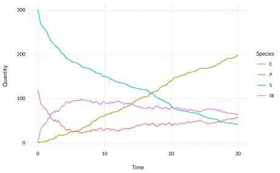
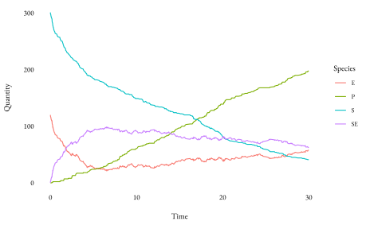
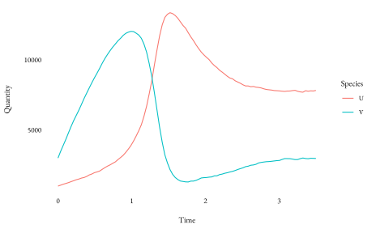

<!-- README.md is generated from README.Rmd. Please edit that file -->

# rendr

<!-- badges: start -->

[](https://github.com/dbarrows/rendr/actions)
[](https://www.tidyverse.org/lifecycle/#maturing)
<!-- badges: end -->

An R package for simulating reaction and reaction-diffusion systems.

## Installation

You can install the development version from
[GitHub](https://github.com/) with:

``` r
devtools::install_github("dbarrows/rendr")
```

## Reaction system solvers

Networks are created using the
[`bondr`](https://github.com/dbarrows/bondr) package. See [Creating
Networks](https://dexter.barrows.io/bondr/#creating-networks) for more
details.

``` r
library(rendr)
```

``` r
(network <- bondr::network_examples())
#> # Reaction network: 3 reactions x 4 species
#>     Reactants    Products     Rate
#> 1       S + E -> SE        0.00166
#> 2          SE -> S + E       1e-04
#> 3          SE -> E + P         0.1
```

### RRE

A deterministic solver that uses the Reaction Rate Equation (RRE) in
conjunction with an ode solver.

``` r
(sys <- rsys(network = network,
             state = c(301, 120, 0, 0),
             T = 30))
#> $network
#> # Reaction network: 3 reactions x 4 species
#>     Reactants    Products     Rate
#> 1       S + E -> SE        0.00166
#> 2          SE -> S + E       1e-04
#> 3          SE -> E + P         0.1
#> 
#> $state
#>   S   E  SE   P 
#> 301 120   0   0 
#> 
#> $T
#> [1] 30
```

``` r
(sol <- rre(sys))
#> Network
#> # Reaction network: 3 reactions x 4 species
#>     Reactants    Products     Rate
#> 1       S + E -> SE        0.00166
#> 2          SE -> S + E       1e-04
#> 3          SE -> E + P         0.1
#> 
#> Solution
#> # A tibble: 100 x 5
#>     Time     S     E    SE      P
#>    <dbl> <dbl> <dbl> <dbl>  <dbl>
#>  1 0      301  120     0    0    
#>  2 0.303  285. 104.   16.2  0.255
#>  3 0.606  271.  90.9  29.1  0.947
#>  4 0.909  260.  80.6  39.4  1.99 
#>  5 1.21   250.  72.1  47.9  3.32 
#>  6 1.52   241.  65.2  54.8  4.88 
#>  7 1.82   234.  59.5  60.5  6.62 
#>  8 2.12   227.  54.8  65.2  8.53 
#>  9 2.42   221.  50.9  69.1 10.6  
#> 10 2.73   216.  47.6  72.4 12.7  
#> # … with 90 more rows
```

A function is provided for easy visualisation of solutions.

``` r
ggplot2::theme_set(wplot::theme_wc())
plot(sol)
```



### SSA

Generate a single realisation of the Chemical Master Equation (CME)
solution via the Stochastic Solution Algorithm (SSA).

``` r
ssa(sys, all.out = TRUE) %>% plot()
```



## Reaction-diffusion system solvers

Reaction-diffusion systems created via the `rdsys` class, which are
constructed similarly to `rsys`s.

``` r
(sys <- rdsys(
    network = network("
             0 <-> U,  4e3, 2
             0  -> V,  1.2e4
        2U + V  -> 3U, 12.5e-8
    "),
    volume = volume(
        dims = c(40, 1, 1),
        h = 1/40,
        seed = c(25, 75)
    ),
    D = c(1e-3, 1e-1),
    T = 3.5
))
#> $network
#> # Reaction network: 4 reactions x 2 species
#>     Reactants    Products      Rate
#> 1           0 -> U             4000
#> 2           U -> 0                2
#> 3           0 -> V            12000
#> 4      2U + V -> 3U        1.25e-07
#> 
#> $volume
#> # dims: 40 x 1 x 1
#> # h: 0.025
#> # states: 
#> # # A tibble: 40 x 5
#>       x     y     z     U     V
#>   <int> <int> <int> <dbl> <dbl>
#> 1     1     1     1    25    75
#> 2     2     1     1    25    75
#> 3     3     1     1    25    75
#> 4     4     1     1    25    75
#> 5     5     1     1    25    75
#> # … with 35 more rows
#> 
#> $D
#>     U     V 
#> 0.001 0.100 
#> 
#> $T
#> [1] 3.5
```

### ISSA

Generate a single realisation of the Reaction-diffusion Master Equation
(RDME) solution via the Inhomogeneous Stochastic Solution Algorithm
(ISSA).

``` r
issa(sys) %T>%
    print() %>%
    plot()
#> Starting ISSA simulation with parameters:
#>  - Reactions:   4
#>  - Species:     2
#>  - Dimensions:  40x1x1
#>  - h:           0.025
#>  - time:        [0, 3.5]
#> ....................................................................................................
#> Network
#> # Reaction network: 4 reactions x 2 species
#>     Reactants    Products      Rate
#> 1           0 -> U             4000
#> 2           U -> 0                2
#> 3           0 -> V            12000
#> 4      2U + V -> 3U        1.25e-07
#> 
#> Solution
#> # 100 time points x 2 species
```



### NSM

Generate a single realisation of the (RDME) solution via the Next
Subvolume Method (NSM). Usage of the `nsm` function is the same as with
the [ISSA solver](#issa). The NSM algorithm is usually faster for
systems with a large number of subvolume (voxels) relative to the
reaction network size. You may have to try both the ISSA and NSM solver
to see which is faster for a given reaction-diffusion system.

``` r
system.time(issa(sys, verbose = FALSE))
#>    user  system elapsed 
#>  18.042   0.013  18.061
system.time(nsm(sys, verbose = FALSE))
#>    user  system elapsed 
#>   8.885   0.007   8.895
```

``` r
sys_small <- sys
sys_small$volume <- volume(
        dims = c(2, 1, 1),
        h = 1/40,
        seed = c(25, 75)
    )
system.time(issa(sys_small, verbose = FALSE))
#>    user  system elapsed 
#>   0.101   0.002   0.103
system.time(nsm(sys_small, verbose = FALSE))
#>    user  system elapsed 
#>   0.122   0.001   0.123
```
