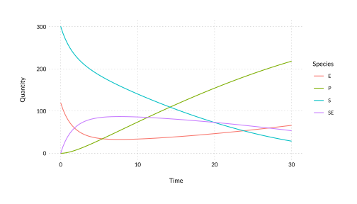

<!-- README.md is generated from README.Rmd. Please edit that file -->

# reactor

<!-- badges: start -->

<!-- badges: end -->

An R package for simulating reaction and reaction-diffusion systems.

## Installation

You can install the development version from
[GitHub](https://github.com/) with:

``` r
devtools::install_github("dbarrows/reactor")
```

## Reaction system solvers

Networks are created using the
[`bondr`](https://github.com/dbarrows/bondr) package. See [Creating
Networks](https://github.com/dbarrows/bondr#creating-networks) for more
details.

``` r
library(reactor)

(mm_network <- parse_network(bondr::mm_string))
#> # Reaction network: 3 reactions x 4 species
#>     Reactants    Products     Rate
#> 1       S + E -> SE        1.66e-3
#> 2          SE -> S + E        1e-4
#> 3          SE -> E + P        1e-1
```

#### RRE

A deterministic solver that uses the Reaction Rate Equation (RRE) in
conjunction with an ode solver.

``` r
y <- c(301, 120, 0, 0)
tspan <- c(0, 30)
sol <- rre(mm_network, y, tspan)
head(sol)
#> # A tibble: 6 x 5
#>    Time     S     E    SE     P
#>   <dbl> <dbl> <dbl> <dbl> <dbl>
#> 1 0      301  120     0   0    
#> 2 0.303  285. 104.   16.2 0.255
#> 3 0.606  271.  90.9  29.1 0.947
#> 4 0.909  260.  80.6  39.4 1.99 
#> 5 1.21   250.  72.1  47.9 3.32 
#> 6 1.52   241.  65.2  54.8 4.88
```

A function is provided for easy visualisation of solutions.

``` r
solution_plot(sol)
```



#### SSA

Generate a single realisation of the Chemical Master Equation (CME)
solution via the Stochastic Solution Algorithm (SSA).

``` r
ssa(mm_network, c(301, 120, 0, 0), c(0, 30)) %>%
    solution_plot()
```


